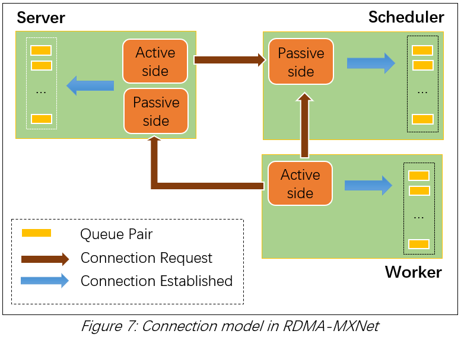
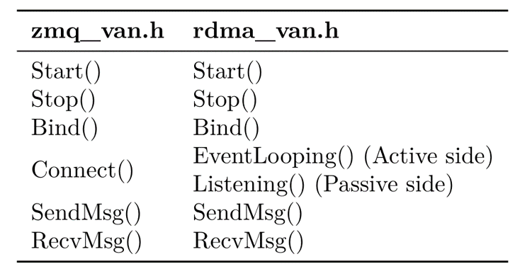
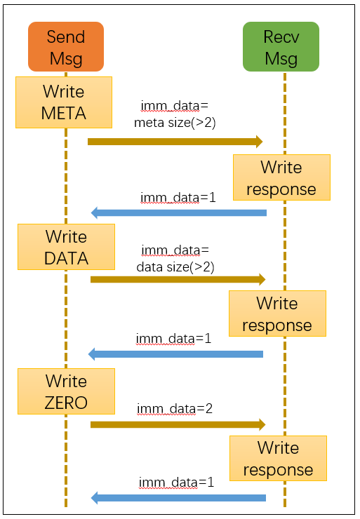

# RDMA-enabled ps-lite

We provide an `RDMAVan` for ps-lite, which transfers messages by RDMA.

## How to merge it into MXNet?

1. Just replace `MXNet/ps-lite` with our ps-lite.
2. Add `-lrdmacm -libverbs` to the additional link flags.
3. Compile as before.

*It sometimes get stuck when wc status is not success. We would add error handle for it later.*

## Technical details

### Connection building

### Self connection

We implement self-transferring using a local Meta structure to avoid self connection. Receiving thread is notified by setting the  local tag self_transferring as true.

## Send/Recv message

We use `RDMA-write-with-immediate-data` operation when transferring message, `RDMA-send/receive` operation when building connection. So that threads won't get confused when polling the completion queue ( all QPs shared the same CQ ).

### Work flow of message transferring

When sending `data`, `imm_data` will be set as the length of it. Otherwise, it will be set as $1$ as ready-to-send, $2$ as terminating. ( can't be set as $0$ because it would send empty data. )